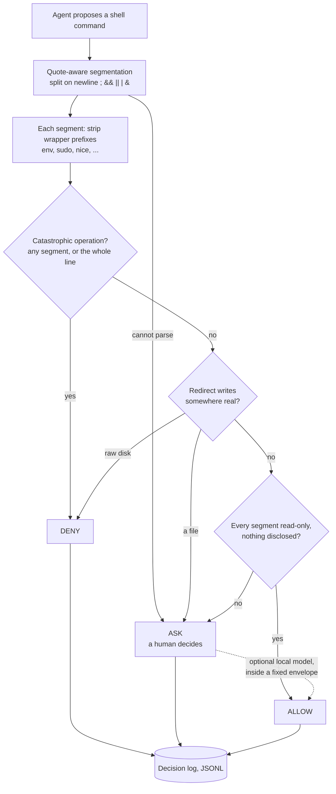

# AB.Agentic Runtime Guardrails

[](https://github.com/andreybuilt/agent-guardrails/actions/workflows/tests.yml)

Six hooks that stop a coding agent's unsafe actions **before they execute**, instead of warning
about them afterwards. Tested against a 108-case adversarial battery, and published with the
bypasses that are still open.

---

## Proof

| Signal | Evidence |
|---|---|
| Runtime protection | Six hooks. Five run as `PreToolUse` and refuse before the command runs; one runs as `Stop` and sends the turn back. Five of the six run against a real agent workload. |
| Adversarial coverage | 108-case classifier battery with zero wrong-allow, plus a 13-case `guard-find` matrix, a 13-case `guard-git` matrix, and 11 bypasses reported by an adversarial review, pinned as regression cases. |
| Observed use | 40,837 logged decisions from the classifier's own production log. |
| Failure posture | A wrong allow is the only unacceptable outcome. Ambiguity asks; catastrophe denies. |
| Transparency | The open bypasses are listed [below](#known-limitations). Both production denials are published in full, including the one that was an over-block. |
| Reproducibility | `./tests/run-all.sh` runs the whole suite on your machine, and in CI on every push and pull request. |

---

## How it works

The busiest hook, `bash-approver.py`, decides every shell command the agent proposes:



A command is allowed only if **every** segment is. The optional model can promote an ASK to an
ALLOW for a fixed set of inline-expression commands; it can never override a DENY, and it is off
by default and fails closed.

The other five hooks each refuse one narrow shape and let its harmless twin through. They are
listed in the [catalogue](#guardrail-catalogue).

---

## Quick start

```bash
git clone https://github.com/andreybuilt/agent-guardrails
cd agent-guardrails && ./tests/run-all.sh
mkdir -p ~/.claude/hooks && cp hooks/* ~/.claude/hooks/ && chmod +x ~/.claude/hooks/*
# then merge settings.example.json into your agent's settings
```

`guard-find.sh` needs `jq` and `python3`. Every Python hook needs only the standard library.
The wiring, including which event each hook belongs to, is in
[`settings.example.json`](settings.example.json).

---

## Guardrail catalogue

| Hook | Event | Refuses | How it refuses |
|---|---|---|---|
| `bash-approver.py` | `PreToolUse` | Auto-approves side-effect-free commands, denies catastrophic ones, asks about everything else. Quote-aware segmenter, redirect analysis, wrapper/env-prefix stripping, `git -C` handling. | `permissionDecision: "deny"` |
| `guard-find.sh` | `PreToolUse` | Any `find` carrying `-delete`, `-exec`, `-execdir`, `-ok`, `-okdir`, `-fprint`, `-fprintf`, `-fls`. | `exit 2` |
| `guard-sequenced-precondition.py` | `PreToolUse` | A precondition check followed by `;` or a newline, or piped into anything. Both shapes destroy its exit status. | `exit 2` |
| `guard-agent-model.py` | `PreToolUse` | A subagent spawn with no explicit `model`, which silently inherits the parent's (usually the most expensive one available). | `exit 2` |
| `guard-git.py` | `PreToolUse` | Five git operations that discard work, **and only when work would actually be lost**: `push --force` always; `reset --hard` with tracked changes; `clean -f` with untracked files; `branch -D` holding unmerged commits; `worktree remove --force` on a dirty tree. | `exit 2` |
| `orphan-tooling-guard.py` | `Stop` | Session-scoped executables written to `/tmp` that exist nowhere in the work tree. Matches on **content hash, not filename**, so a rescue that renames the file still counts. | `{"decision":"block"}` |

The last column matters more than it looks. The six hooks use three different refusal mechanisms,
and a check built to find one of them silently misses the others.
[`docs/counting-the-hooks.md`](docs/counting-the-hooks.md) is what that did to a hook count.

### Why a hook rather than a permission rule

Most agent permission systems match on command **prefix**. A prefix rule cannot express
"`find`, but only when it carries `-delete`"; it can only allow all `find` or block all `find`.
A PreToolUse hook sees the real command string, so it can block one shape and leave the other
alone.

### Configuration

| Variable | Used by | Meaning |
|---|---|---|
| `BASH_APPROVER_LOG` | `bash-approver.py` | Append decisions as JSONL, for tuning. |
| `BASH_APPROVER_MODEL` | `bash-approver.py` | `ollama:MODEL@HOST:PORT`. Lets a local model promote gray commands to allow. **Off by default, fails closed.** |
| `GUARD_PRECONDITION_RE` | `guard-sequenced-precondition.py` | Python regex matching your own precondition command. Defaults to a distributed-lock acquire. |
| `AGENT_GUARDRAILS_TREE` | `orphan-tooling-guard.py` | Path to the work tree that counts as "durable". |
| `GUARD_LEAK_RE` | `tests/run-all.sh` | Extra identifiers the pre-publish sweep must refuse. Defaults to your own username and home path. |

---

## Security model

An agent asked not to do something will usually not do it. "Usually" is the problem.

The failures worth guarding against come from a model trying to be careful, where the shape of the
command defeats the check:

- A safety classifier reads `find . -name '*.py'` and allows it, so it also allows
  `find . -name '*.py' -delete`.
- A caller writes `precondition-check ... ; do-the-work`. The check refuses, prints, returns 1.
  The `;` runs the work anyway.
- A classifier splits on shell whitespace with `shlex`, which eats newlines, so
  `ls\nrm -rf ~` collapses to base command `ls` and gets allowed.

All three happened here. All three are now test cases.

**A wrong ALLOW is the only unacceptable outcome.** A wrong ASK is friction; a wrong DENY is
friction with a stronger opinion. Ambiguity resolves to ASK.

The production numbers show that asymmetry. Across **40,837 logged decisions**:

| Decision | Count | Share |
|---|---:|---:|
| ask (fell through to the human) | 33,034 | 80.9% |
| allow (auto-approved read-only) | 7,801 | 19.1% |
| deny (blocked outright) | 2 | 0.005% |

Four fifths of traffic goes to a human, by design. The 19% the classifier absorbs is the pure-read
tail that generated most of the prompt fatigue. The figures describe `bash-approver.py`, not the
set, and `guard-sequenced-precondition.py` runs nowhere yet, so no production number is claimed
for it.

One of the two denials stopped a disk erase. The other was an over-block, and my first explanation
of it was wrong about my own code. Both are in
[`docs/adversarial-findings.md`](docs/adversarial-findings.md).

---

## Test strategy

```bash
./tests/run-all.sh
```

`bash-approver.py --selftest` runs a **108-case adversarial battery** and exits non-zero on any
wrong-allow. Each case entered the battery after a bypass got through, so they are regression
tests rather than illustrations. The battery covers newline-separated segments, `&&`/`||`/`;`/`|`
sequencing, redirect targets, `env`/`sudo`/`nice` wrapper prefixes, `$()` and heredocs, and quoted
strings that only look dangerous (`echo 'rm -rf /'` has to stay allowed).

`guard-git.py` carries a **13-case matrix** in `tests/test-guard-git.sh` that builds real
temporary repositories and drives the hook through both halves of every rule: six commands it
must refuse, and seven wrongly-satisfied twins it must allow. Three of those seven are false
positives the hook shipped with and had fixed within a day. `guard-find.sh` has its own 13 cases,
six of them cases it must allow.

`tests/adversarial/` replays every bypass an adversarial review reported against these hooks and
fails the build if any comes back. The suite also checks that `settings.example.json` wires each
hook at the event it declares, and ends with a leak sweep for identifiers.

---

## Known limitations

An adversarial pass on 2026-09-07 attacked these hooks with the published table in hand and
instructions to find what was **not** in it. It found eleven shapes. All eleven are now closed and
pinned by `tests/adversarial/`, which fails the build if any of them comes back. What follows is
what survived that pass, and it is shorter than the list of what did not.

| Hook | Shape that still gets through | Why |
|---|---|---|
| `guard-sequenced-precondition.py` | `sh -c '...'`, `bash -c '...'`, `ssh host '...'`, a single `&` | Only the first operator at the top level is examined; a wrapper hides the sequence inside an argument. |
| `guard-sequenced-precondition.py` | `"lease.sh" acquire`, `l\ease.sh acquire`, `lease.sh 'acquire'` | The precondition is matched as text, so quoting or escaping the command name defeats the matcher while the shell still runs the real thing. |
| `bash-approver.py` | anything a safe-list answers the wrong question about | The class stays open even though every reported instance is closed. A list that answers "is this subcommand read-only" cannot see danger that lives in an option. |
| `bash-approver.py` | `file -C -m FILE` | A read-only-looking command that writes through a flag the redirect analysis does not model. The `git --output=` and `sort --output=` forms of this were closed 2026-09-07. |
| `bash-approver.py` | disclosure through a variable name the marker list does not carry | It matches credential-shaped NAMES, so it catches what it has seen. `echo $SECRET` was the example this README used, and a reviewer found that example is one of the cases it already blocks, while `echo $OPENAI_API_KEY` and `echo $GH_PAT` went through. Those are now covered; the class is open by construction. |
| `orphan-tooling-guard.py` | anything five directories deep, `.pl`, `.rb`, extensionless | The walk stops at depth 5, and it hashes `.sh` and `.py` only. |
| `guard-agent-model.py` | `model="inherit"` | It requires a non-empty model and does not validate the value. |

---

## Engineering notes

The investigation behind these hooks is the most useful part of the repository, and it lives in
`docs/` so it does not stand between you and the install:

- [`docs/war-stories.md`](docs/war-stories.md): every incident that produced a hook: the command,
  why the check said yes, and the fix.
- [`docs/adversarial-findings.md`](docs/adversarial-findings.md): both production denials in full,
  and what two adversarial reviews closed, including nine wrong-allows in the classifier.
- [`docs/counting-the-hooks.md`](docs/counting-the-hooks.md): why there is no published fleet
  total. Four careful counts of one fleet on one day gave four answers.

---

## What this repository leaves out

- **A hook that logs instead of blocking.** I measured one guard from the original set, found it
  net-negative, and emptied its blocking set. The code stays out of this repository, because a
  disarmed guard still looks like protection. [`docs/war-stories.md`](docs/war-stories.md) tells
  that story.
- **Anything tied to a specific fleet.** I stripped hostnames, IP tables, and internal tool names.
  Where a hook needs one, it reads an environment variable.

---

## License

MIT. See [LICENSE](LICENSE).
